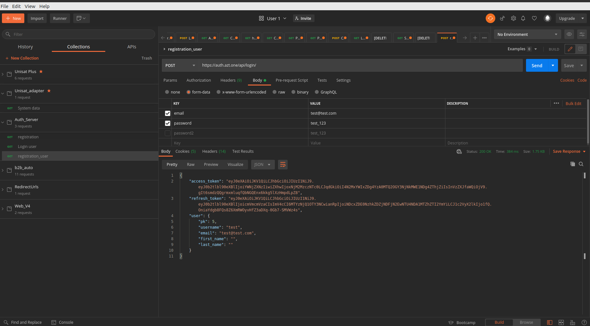
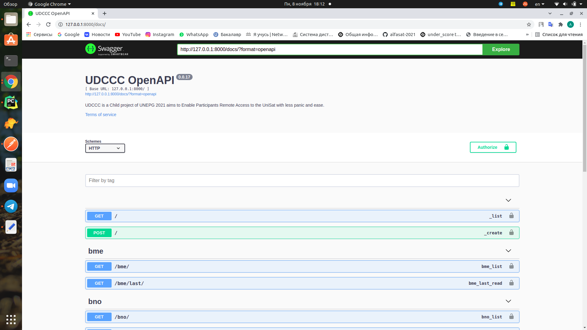
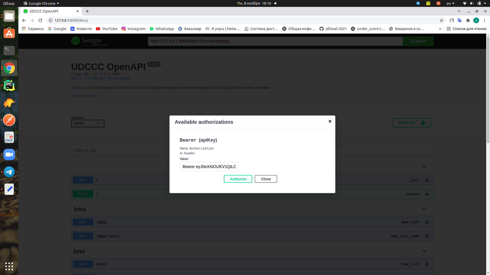

# UDCCC OpenAPI Documentation

## Introduction


UDCCC (UniSat Data & Control & Communication Center) API is a Restful API based on OpenAPI standards. With the help of which you will be able to communicate with UniSat nano-satellites through the internet using nothing complicated and special but your browser.

All of the programs behind this API are running right inside the UniSat satellite itself. All honor belongs to the tiny yet powerful RPi computer inside the satellite. 

You have two options to communicate with our satellite using this API:

First, you can use our pre-integrated website at https://unisat.xlink.kz (inside KZ) or https://unisat.xlink.run (outside KZ) without any technical boundaries. 

Secondly, especially recommended for those with technical background, you can use any API tools which supports the OpenAPI standard to explore and communicate the UniSat.

UPDATED: 2021-10-27 BY Azat @azataiot 
Note: We also have a third option to communicate with our satellite using Google Colab, with this link: https://go.xlink.run/colab
## Authorization

To access the api, you need to log in to

```
https://auth.azt.one/api/login/
```

using Postman or another http agent



and get *access_token* or *refresh_token*

Then go to the 
```
https://domen.com/docs/
```


Click *Authorize* and input:

```
Bearer #token
```


Then use API like in Technical Documentation

## Technical Documentation
To access the api, you need to log in to

To start your work, please test the endpoints first either with:    
- GET `/`

  Request : 

  ```bash
  curl -X 'GET' \
    'URL:8000/' \
    -H 'accept: application/json'
  ```

  Response :

  ```json
  {
    "msg": "Hello from UniSat Team"
  }
  ```

- POST `/`

  Request:

  ```bash
  curl -X 'POST' \
    'URL/?msg=ping' \
    -H 'accept: application/json' \
    -d ''
  ```

  Response:

  ```json
  {
    "msg": "pong"
  }
  ```

  

  Then, you can use other endpoints. They are:    


- GET `/now`

  Request:

  ```bash
  curl -X 'GET' \
    'URL/now' \
    -H 'accept: application/json'
  ```

  Response:

  ```json
  {
    "now": "2021-10-27T09:37:29.567935"
  }
  ```

- GET `/system/last`

  Request:

  ```bash
  curl -X 'GET' \
    'URL/system/last' \
    -H 'accept: application/json'
  ```

  Response:

  ```json
  {
    "id": 5,
    "updated": "2021-10-27T08:13:04.729070",
    "cam_supported": 2,
    "cam_detected": 2,
    "state": "0x0",
    "temperature": 44,
    "arm_clock": 1200000000,
    "core_clock": 400000000,
    "serial_clock": 47999000,
    "storage_clock": 249960000,
    "voltage": 1.4,
    "otp": {
      "10": "0x00000000",
      "11": "0x00000000",
      "12": "0x00000000",
      "13": "0x00000000",
      "14": "0x00000000",
      "15": "0x00000000",
      "16": "0x00280000",
      "17": "0x1020000a",
      "18": "0x1020000a",
      "19": "0xffffffff",
      "20": "0xffffffff",
      "21": "0xffffffff",
      "22": "0xffffffff",
      "23": "0xffffffff",
      "24": "0xffffffff",
      "25": "0xffffffff",
      "26": "0xffffffff",
      "27": "0x00002727",
      "28": "0xce530176",
      "29": "0x31acfe89",
      "30": "0x00a02100",
      "31": "0x00000000",
      "32": "0x00000000",
      "33": "0x00000000",
      "34": "0x00000000",
      "35": "0x00000000",
      "36": "0x00000000",
      "37": "0x00000000",
      "38": "0x00000000",
      "39": "0x00000000",
      "40": "0x00000000",
      "41": "0x00000000",
      "42": "0x00000000",
      "43": "0x00000000",
      "44": "0x00000000",
      "45": "0x00000000",
      "46": "0x00000000",
      "47": "0x00000000",
      "48": "0x00000000",
      "49": "0x00000000",
      "50": "0x00000000",
      "51": "0x00000000",
      "52": "0x00000000",
      "53": "0x00000000",
      "54": "0x00000000",
      "55": "0x00000000",
      "56": "0x00000000",
      "57": "0x00000000",
      "58": "0x00000000",
      "59": "0x00000000",
      "60": "0x00000000",
      "61": "0x00000000",
      "62": "0x00000000",
      "63": "0x00000000",
      "64": "0x00000000",
      "65": "0x00000000",
      "66": "0x00000000",
      "08": "0x00000000",
      "09": "0x00000000"
    },
    "cpu_memory": 896,
    "gpu_memory": 128,
    "config": {
      "aphy_params_current": "819",
      "arm_freq": "1200",
      "arm_freq_min": "600",
      "audio_pwm_mode": "514",
      "config_hdmi_boost": "5",
      "core_freq": "400",
      "desired_osc_freq": "0x387520",
      "disable_commandline_tags": "2",
      "disable_l2cache": "1",
      "display_hdmi_rotate": "-1",
      "display_lcd_rotate": "-1",
      "dphy_params_current": "547",
      "dvfs": "3",
      "enable_tvout": "1",
      "enable_uart": "1",
      "force_pwm_open": "1",
      "framebuffer_ignore_alpha": "1",
      "framebuffer_swap": "1",
      "gpu_freq": "300",
      "ignore_lcd": "1",
      "init_uart_clock": "0x2dc6c00",
      "max_framebuffers": "-1",
      "over_voltage_avs": "0x30d40",
      "pause_burst_frames": "1",
      "program_serial_random": "1",
      "sdram_freq": "450",
      "total_mem": "1024",
      "hdmi_force_cec_address:0": "65535",
      "hdmi_force_cec_address:1": "65535",
      "hdmi_pixel_freq_limit:0": "0x9a7ec80"
    },
    "space": {
      "total": 15379906560,
      "used": 3470659584,
      "free": 11250446336
    },
    "memory": {
      "total": 914010112,
      "available": 781688832,
      "percent": 14,
      "used": 72515584,
      "free": 716390400,
      "active": 66166784,
      "inactive": 85053440,
      "buffers": 22134784,
      "cached": 102969344,
      "shared": 6107136,
      "slab": 29331456
    }
  }
  ```

- GET `/system`

  Request:

  ```bash
  curl -X 'GET' \
    'URL/system?skip=0&limit=100' \
    -H 'accept: application/json'
  ```

- GET `/bme/last`

  Request:

  ```bash
  curl -X 'GET' \
    'URL/bme/last' \
    -H 'accept: application/json'
  ```

  Response:

  ```json
  {
    "id": 10,
    "updated": "2021-10-27T05:32:57.648263",
    "temperature": 33.6,
    "pressure": 920.87,
    "humidity": 15.497
  }
  ```

- GET `/bme`

  Request:

  ```bash
  curl -X 'GET' \
    'URL/bme?skip=0&limit=100' \
    -H 'accept: application/json'
  ```

- GET `/bno/last`

  Request:

  ```bash
  curl -X 'GET' \
    'URL/bno/last' \
    -H 'accept: application/json'
  ```

  Response:

  ```json
  {
    "id": 3,
    "updated": "2021-10-27T05:33:04.518696",
    "temperature": 33,
    "acceleration": {
      "id": 3,
      "bno_id": 3,
      "x": 1.45,
      "y": 0.65,
      "z": 9.68
    },
    "magnetic": {
      "id": 3,
      "bno_id": 3,
      "x": -24.5625,
      "y": -8.5625,
      "z": -43.5625
    },
    "gyro": {
      "id": 3,
      "bno_id": 3,
      "x": -0.002181661564992912,
      "y": -0.004363323129985824,
      "z": 0
    },
    "euler": {
      "id": 3,
      "bno_id": 3,
      "x": 0,
      "y": 0,
      "z": 0
    },
    "quaternion": {
      "id": 3,
      "bno_id": 3,
      "w": 0,
      "x": 0,
      "y": 0,
      "z": 0
    },
    "linear_acceleration": {
      "id": 3,
      "bno_id": 3,
      "x": 0,
      "y": 0,
      "z": 0
    },
    "gravity": {
      "id": 3,
      "bno_id": 3,
      "x": 0,
      "y": 0,
      "z": 0
    }
  }
  ```

- GET `/bno`

  Request:

  ```bash
  curl -X 'GET' \
    'URL/bno?skip=0&limit=100' \
    -H 'accept: application/json'
  ```

- GET `/si/last`

  Request:

  ```bash
  curl -X 'GET' \
    'URL/si/last' \
    -H 'accept: application/json'
  ```

  Response:

  ```json
  {
    "id": 1,
    "updated": "2021-10-27T04:41:07.276279",
    "vis": 0,
    "ir": 253,
    "uv": 2
  }
  ```

- GET `/si`

  Request:

  ```bash
  curl -X 'GET' \
    'URL/si?skip=0&limit=100' \
    -H 'accept: application/json'
  ```

- GET `/geiger/last` **DEPRICATED**

  

  


